<!-- GitHub profile README for github.com/ayushgoel001 -->

<div align="center">



### Software Engineering + Applied AI @ IIT Kharagpur

I build reliable backend systems and applied AI products with measurable performance.

<p>
  <a href="https://github.com/ayushgoel001"></a>&nbsp;
  <a href="https://www.linkedin.com/in/ayush-goel-4b6469297/"></a>&nbsp;
  <a href="https://codeforces.com/profile/ayushgoel02"></a>
</p>

</div>

## `whoami.cpp`

```cpp
#include <array>
#include <string_view>

namespace profile {
using namespace std::literals;

class AyushGoel final {
public:
    constexpr AyushGoel() noexcept = default;
    AyushGoel(const AyushGoel&) = delete;            // one of one
    AyushGoel& operator=(const AyushGoel&) = delete;

    static constexpr auto university = "IIT Kharagpur"sv;
    static constexpr auto degree = "B.Tech. (Hons.), Chemical Engineering"sv;
    static constexpr auto specialization = "Artificial Intelligence & Applications"sv;

    static constexpr std::array<std::string_view, 5> core{
        "C++"sv, "Python"sv, "Backend Systems"sv, "Algorithms"sv, "Applied AI"sv
    };

    [[nodiscard]] constexpr auto current_focus() const noexcept {
        return "scalable APIs | system design | performance engineering"sv;
    }

    [[nodiscard]] constexpr auto engineering_loop() const noexcept {
        return "build -> benchmark -> optimize -> repeat"sv;
    }

    static constexpr bool open_to_collaborate = true;
    static constexpr bool ships_without_tests = false;
};
} // namespace profile

int main() {
    constexpr profile::AyushGoel ayush{};
    static_assert(ayush.engineering_loop() ==
                  "build -> benchmark -> optimize -> repeat");

    return ayush.open_to_collaborate ? 0 : 1;         // exit(0): let's build
}
```

## About me

I am a B.Tech. (Hons.) undergraduate in Chemical Engineering at **IIT Kharagpur** with a Micro-specialization in **Artificial Intelligence and Applications**.

My work sits at the intersection of **backend engineering, algorithms, and applied AI**. I enjoy turning ideas into systems whose reliability, latency, throughput, or accuracy can be measured - from LLM infrastructure and document intelligence to computer vision and robot motion planning.

> Currently deepening my work in scalable APIs, distributed systems, system design, and performance-focused software engineering.

## Impact at a glance

| Backend systems | API performance | Document intelligence | Algorithms |
| :---: | :---: | :---: | :---: |
| **164 RPS**<br><sub>zero failures in a local load test</sub> | **86.7% lower p50**<br><sub>cached vs. uncached local requests</sub> | **75x faster**<br><sub>repeat OCR extraction</sub> | **Expert - 1638**<br><sub>Codeforces peak rating</sub> |

## Selected engineering

### [ModelRoute](https://github.com/ayushgoel001/ModelRoute) - Resilient Multi-Provider LLM API Gateway

`FastAPI` `Redis` `PostgreSQL` `Docker` `Async I/O`

A production-minded gateway for routing, caching, rate limiting, fallback, and observability across LLM providers.

- Built three routing strategies across OpenAI and Gemini adapters with bounded retries and automatic fallback.
- Implemented exact-response caching, an atomic Redis Lua token bucket, and PostgreSQL p50/p95 metrics.
- Benchmarked 1,600 local requests across four concurrency levels, reaching **164 RPS with zero failures**.

[Repository](https://github.com/ayushgoel001/ModelRoute) · [Live demo](https://modelroute.onrender.com/) · [API docs](https://modelroute.onrender.com/docs)

---

### [ProctorVision](https://github.com/ayushgoel001/proctorvision) - Vision-Guided Proctoring Review Platform

`FastAPI` `YOLO` `MediaPipe` `Computer Vision` `GitHub Actions`

A review-first computer vision system that turns noisy frame-level detections into persistent behavioral alerts.

- Designed a five-rule AlertEngine with duration, grace-period, and cooldown controls.
- Improved throughput by **about 19%**, reducing average frame latency from **279.4 ms to 234.9 ms**.
- Built candidate tracking using IoU, center distance, and area similarity; validated with **79 automated tests**.

[Repository](https://github.com/ayushgoel001/proctorvision)

---

### [Deterministic PRM + A*](https://github.com/ayushgoel001/prm-astar-path-planning) - Motion Planning and Graph Search

`Python` `SciPy` `NumPy` `KDTree` `A*` `OpenCV`

A deterministic motion-planning system combining probabilistic roadmaps, spatial search, collision checking, and A*.

- Constructed **502-node** roadmaps with **2,233-5,312** collision-validated edges.
- Completed graph searches in **1.5-19.6 ms**.
- Produced **21%-23% shorter successful paths** than goal-biased RRT across three benchmark maps and 60 matched-seed runs.

[Repository](https://github.com/ayushgoel001/prm-astar-path-planning)

## Experience

- **Software Development Engineer Intern - Wasserstoff**<br>
  Built a FastAPI OCR pipeline using Tesseract, Docling, OpenCV, Docker, caching, and concurrent processing. Reduced character error rate from **0.481 to 0.080** and repeat extraction time from **30.1 s to 0.4 s**.

- **Undergraduate Research Intern - University of Manchester & University of Liverpool**<br>
  Engineered forecasting data and evaluation pipelines over **225 Zarr stores** and **29M+ grid-point predictions**, adapting an **89.1M-parameter** weather model while training only **0.23%** of its parameters.

- **Machine Learning Developer Intern - Chi SquareX Technologies**<br>
  Built an OpenAI Gymnasium options-trading environment and trained PPO/A2C agents with Stable-Baselines3, achieving a **54.05% backtest return** over ten months of historical data.

- **Undergraduate Researcher - Aerial Robotics Research Group, IIT Kharagpur**<br>
  Worked with ROS, Gazebo, MAVROS, drone simulation, perception algorithms, and autonomous-system tooling.

## Technical toolkit

<div align="center">


</div>
| Core | Backend and data | Applied AI | Engineering |
| --- | --- | --- | --- |
| C++, C, Python, SQL, JavaScript | FastAPI, Node.js, Express, PostgreSQL, Redis, MongoDB, REST APIs | PyTorch, OpenCV, YOLO, MediaPipe, NumPy, SciPy | Docker, Linux, GitHub Actions, pytest, Postman |

## Competitive programming

- **Codeforces Expert** with a peak rating of **1638** and **500+** algorithmic problems solved.
- Global ranks **1,863**, **2,320**, and **3,704** in Codeforces Rounds 1110, 1111, and 1115.
- **Rank 22** in the Optiver Quantitative Trade-a-thon 2026.
- **All-India Rank 7** in Round 1 of Convolve 4.0, the Pan-IIT AI/ML Hackathon.

## Contribution activity

<div align="center">

<a href="https://github.com/ayushgoel001" aria-label="View Ayush Goel's GitHub profile">
  
</a>

<sub>Live, automatically updated, and clickable.</sub>

</div>

---

<div align="center">

**Engineering systems that are reliable, measurable, and built to scale.**

</div>
